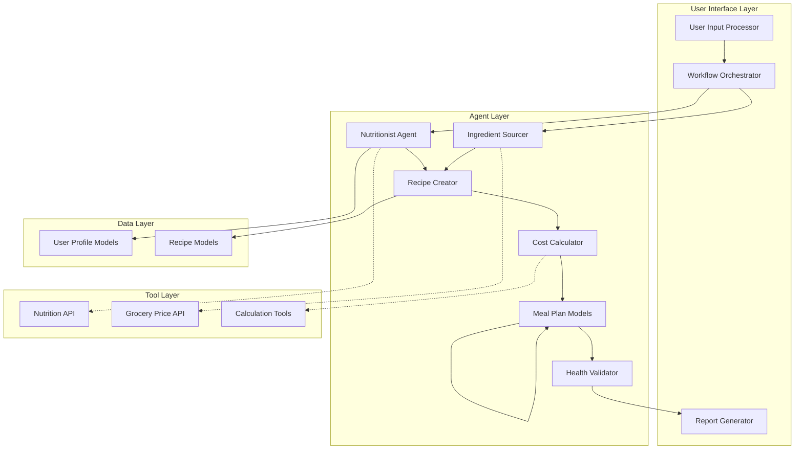
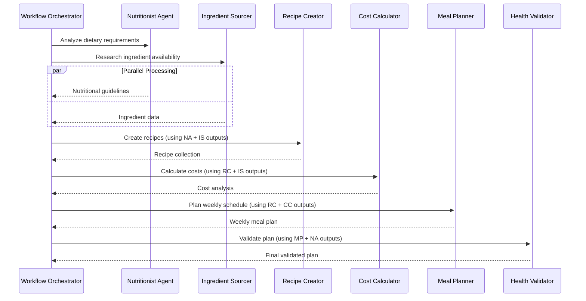
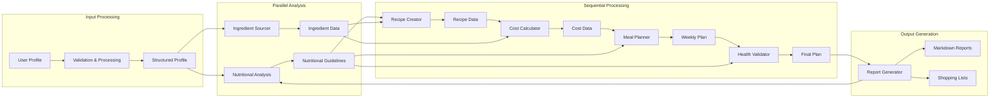
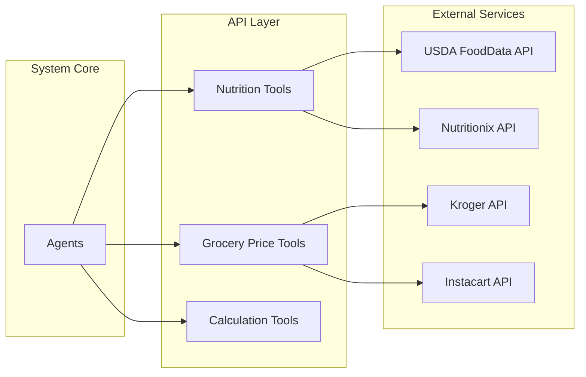
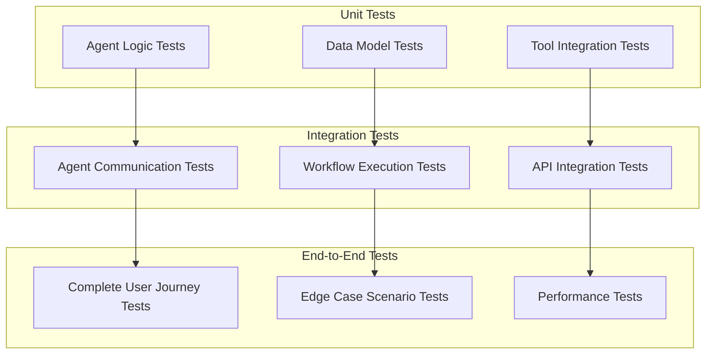

# Architecture Overview - Smart Recipe & Meal Planning System

This document provides a technical overview of the system architecture, agent coordination, and design decisions.

## 🏗️ System Architecture

### High-Level Architecture



### Design Principles

1. **Multi-Agent Coordination**: Specialized agents handle distinct responsibilities
2. **Parallel Processing**: Independent tasks execute simultaneously for efficiency
3. **Context Sharing**: Agents share intermediate results through structured data models
4. **Graceful Degradation**: System continues with reduced functionality if optional services fail
5. **Extensibility**: Modular design allows easy addition of new agents and tools

## 🤖 Agent Architecture

### Agent Coordination Pattern

The system uses a hybrid workflow combining parallel and sequential processing:



### Agent Specifications

#### Nutritionist Agent
- **Primary Function**: Dietary analysis and nutritional requirement calculation
- **Input**: User profile (demographics, health goals, dietary restrictions)
- **Output**: Structured nutritional guidelines and daily targets
- **Tools**: Nutrition API, BMR calculators, dietary analysis algorithms
- **Execution**: Parallel with Ingredient Sourcer

#### Ingredient Sourcer
- **Primary Function**: Ingredient research, pricing, and availability analysis
- **Input**: User profile (location, budget, dietary preferences)
- **Output**: Ingredient availability matrix with pricing and alternatives
- **Tools**: Grocery Price API, ingredient database, location services
- **Execution**: Parallel with Nutritionist Agent

#### Recipe Creator
- **Primary Function**: Custom recipe generation based on requirements
- **Input**: Nutritional guidelines, ingredient data, user preferences
- **Output**: Collection of balanced recipes with detailed instructions
- **Tools**: Recipe database, nutritional calculation tools, cooking algorithms
- **Dependencies**: Requires outputs from Nutritionist and Ingredient Sourcer

#### Cost Calculator
- **Primary Function**: Budget optimization and cost analysis
- **Input**: Recipe collection, ingredient pricing, serving requirements
- **Output**: Cost-optimized meal selections with budget breakdown
- **Tools**: Cost calculation utilities, optimization algorithms
- **Dependencies**: Requires outputs from Recipe Creator and Ingredient Sourcer

#### Meal Planner
- **Primary Function**: Weekly schedule organization and meal distribution
- **Input**: Cost-optimized recipes, nutritional targets, user schedule
- **Output**: Structured weekly meal plan with shopping lists
- **Tools**: Calendar utilities, nutritional balance calculators, meal prep optimizers
- **Dependencies**: Requires outputs from Cost Calculator

#### Health Validator
- **Primary Function**: Final validation and compliance checking
- **Input**: Complete meal plan, nutritional targets, dietary restrictions
- **Output**: Validated meal plan with adjustment recommendations
- **Tools**: Nutritional analysis tools, compliance checkers, report generators
- **Dependencies**: Requires outputs from Meal Planner and Nutritionist Agent

## 🔧 Technical Implementation

### CrewAI Integration

```python
# Crew Configuration Example
crew = Crew(
    agents=[
        nutritionist_agent,
        ingredient_sourcer,
        recipe_creator,
        cost_calculator,
        meal_planner,
        health_validator
    ],
    tasks=[
        nutritional_analysis_task,
        ingredient_research_task,
        recipe_creation_task,
        cost_calculation_task,
        meal_planning_task,
        health_validation_task
    ],
    process=Process.sequential,  # With parallel execution for first two tasks
    verbose=True
)
```

### Data Flow Architecture



### Error Handling Strategy

```python
class ErrorHandlingStrategy:
    """Comprehensive error handling for multi-agent system"""
    
    def handle_agent_failure(self, agent_name: str, error: Exception):
        """Handle individual agent failures with fallback strategies"""
        fallback_strategies = {
            'nutritionist': self.use_basic_nutrition_calculation,
            'ingredient_sourcer': self.use_cached_price_data,
            'recipe_creator': self.use_template_recipes,
            'cost_calculator': self.use_average_cost_estimates,
            'meal_planner': self.use_simple_scheduling,
            'health_validator': self.use_basic_validation
        }
        return fallback_strategies.get(agent_name, self.graceful_degradation)()
    
    def handle_api_failure(self, api_name: str, retry_count: int):
        """Handle external API failures with exponential backoff"""
        if retry_count < self.max_retries:
            wait_time = 2 ** retry_count
            time.sleep(wait_time)
            return True  # Retry
        return False  # Use fallback
```

## 📊 Performance Optimization

### Parallel Processing Strategy

The system optimizes performance through strategic parallel execution:

1. **Independent Analysis Phase**: Nutritionist and Ingredient Sourcer run simultaneously
2. **Shared Context**: Results are merged before sequential processing begins
3. **Resource Management**: Parallel tasks are limited to prevent API rate limiting

### Caching Strategy

```python
class CachingStrategy:
    """Multi-level caching for performance optimization"""
    
    def __init__(self):
        self.nutrition_cache = TTLCache(maxsize=1000, ttl=86400)  # 24 hours
        self.price_cache = TTLCache(maxsize=500, ttl=3600)       # 1 hour
        self.recipe_cache = TTLCache(maxsize=200, ttl=604800)    # 1 week
    
    def get_cached_nutrition(self, ingredient: str):
        """Get cached nutritional data with fallback to API"""
        return self.nutrition_cache.get(ingredient) or self.fetch_nutrition_api(ingredient)
```

### Scalability Considerations

- **Stateless Agents**: All agents are designed to be stateless for horizontal scaling
- **Database Integration**: User profiles and meal plans can be persisted for multi-user scenarios
- **Queue Management**: Background job processing for handling multiple concurrent requests
- **Resource Monitoring**: Built-in monitoring for memory usage and execution time

## 🔌 Integration Architecture

### External API Integration



### Tool Architecture

Each external integration follows a consistent pattern:

```python
class BaseAPITool:
    """Base class for all external API integrations"""
    
    def __init__(self):
        self.session = requests.Session()
        self.cache = TTLCache(maxsize=100, ttl=3600)
        self.rate_limiter = RateLimiter(calls=60, period=60)
    
    def make_request(self, endpoint: str, params: dict):
        """Standardized API request with error handling and caching"""
        with self.rate_limiter:
            try:
                response = self.session.get(endpoint, params=params, timeout=30)
                response.raise_for_status()
                return response.json()
            except requests.RequestException as e:
                return self.handle_api_error(e)
```

## 🧪 Testing Architecture

### Multi-Level Testing Strategy



### Test Data Management

```python
class TestDataFactory:
    """Factory for generating consistent test data across all test levels"""
    
    @staticmethod
    def create_user_profile(profile_type: str):
        """Create standardized test user profiles"""
        profiles = {
            'weight_loss': UserProfile(
                personal_info=PersonalInfo(age=30, weight=80, height=170),
                health_goals=HealthGoals(goal_type='weight_loss', target_calories=1500),
                budget_constraints=BudgetConstraints(weekly_budget=60)
            ),
            'muscle_gain': UserProfile(
                personal_info=PersonalInfo(age=25, weight=70, height=175),
                health_goals=HealthGoals(goal_type='muscle_gain', target_calories=2500),
                budget_constraints=BudgetConstraints(weekly_budget=100)
            )
        }
        return profiles[profile_type]
```

## 🔮 Future Architecture Considerations

### Planned Enhancements

1. **Machine Learning Integration**: User preference learning and recipe recommendation improvement
2. **Real-time Adaptation**: Dynamic meal plan adjustments based on user feedback
3. **Multi-user Support**: Family meal planning with individual dietary requirements
4. **Mobile Integration**: API endpoints for mobile application development
5. **Advanced Analytics**: Nutritional trend analysis and health outcome tracking

### Scalability Roadmap

1. **Microservices Migration**: Break agents into independent microservices
2. **Event-Driven Architecture**: Implement event sourcing for better scalability
3. **Cloud-Native Deployment**: Kubernetes orchestration for auto-scaling
4. **Global Distribution**: Multi-region deployment for reduced latency

This architecture provides a solid foundation for the current system while maintaining flexibility for future enhancements and scaling requirements.